<div align="center">

<picture>
  <source media="(prefers-color-scheme: dark)" srcset="assets/dark.svg">
  <source media="(prefers-color-scheme: light)" srcset="assets/light.svg">
  
</picture>

<br>


<p>
  <a href="https://instagram.com/imnot._aryan"></a>
  <a href="https://linkedin.com/in/aaryansh-rathod-186b09302"></a>
  <a href="https://reddit.com/user/Classic-Pop-8418"></a>
  <a href="mailto:rathoreaaryansh@gmail.com"></a>
</p>

</div>

---

### 💫 About Me

```yaml
current_focus:    "Building AI-powered apps with RAG, LangChain, AI Agents & LLMs — fused with IoT automation"
collaborating_on: "Generative AI · Agentic AI · RAG systems · IoT solutions · open-source AI projects"
seeking_help_in:  "Advanced AI Agents · Model Context Protocol (MCP) · LLM optimization · cloud deployment"
learning:         "LangGraph · CrewAI · MCP · FastAPI · Docker · Vector DBs (FAISS, ChromaDB) · Edge AI"
ask_me_about:     "GenAI · LangChain · RAG · AI Agents · Python · IoT · Embedded Systems · C++ · CP"
fun_fact:         "I turn AI ideas into real-world products — one prompt, one sensor at a time ⚡"
```

---

### 🧠 Tech Stack

<div align="center">

**Languages & Core**


**AI / ML / Data**


**Backend & Deployment**


**Databases**


**IoT & Embedded**


**Tools & Platforms**


**Design**


</div>

---

### 📊 GitHub Stats

<div align="center">
  
  
</div>

<div align="center">
  
</div>

<div align="center">
  
</div>

---

<div align="center">

[](https://visitcount.itsvg.in)

<sub>⚡ Thanks for stopping by — let's build something intelligent together.</sub>

</div>
